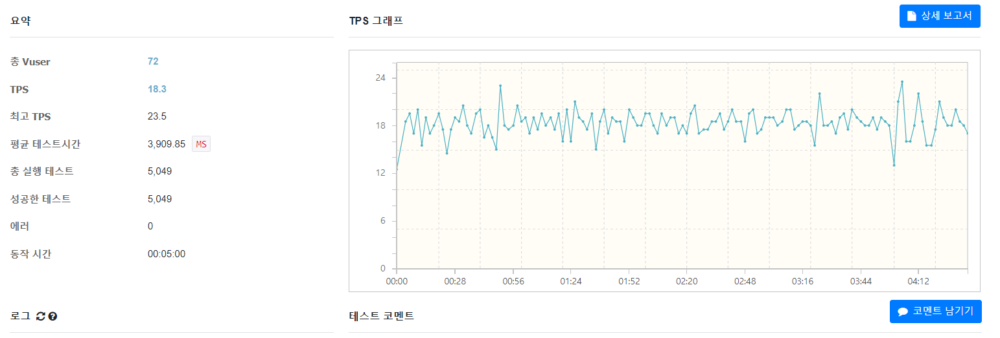
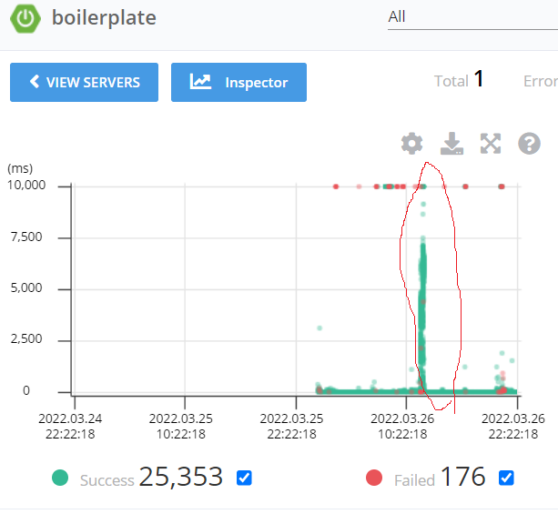
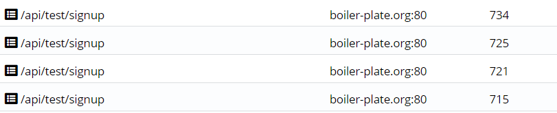
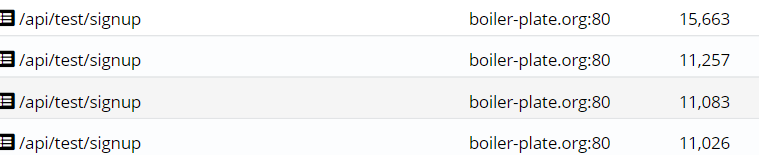

#회원가입 테스트 2탄 ~

https://www.notion.so/TroubleShooting_BE-49d293ccbd0243959f4f400105aae4c7  
위 주소의 호준쓰의 생각1,2 이후의 내용이다.

### 목표 -> 핵심 서비스인  음성 채팅을 위해 내가 맡은 회원관리 ,로그인 부분에 들어가는 자원을 최대한 절약해보자


### 현재 상황 
    ec2를 c-large로 교체했다. 
    교체 이후에 늘어난 Connection Pool을 충분히 활용하는게 보였다
    TPS가 2배나 늘어났고 전에 비해 TPS의 폭도 일정하다(아직 부족하긴 하지만 ...?)
#         

### 현재 발생한 문제
    Vuser를 150명을 설정하고 다시 테스트를 진행했다.
#    
요청 완료까지의 시간이 너무 오래걸린다... 그리고 Failed도 보인다 !!
어느 부분에서  Failed가 발생하고 시간이 지연되는지 알아보자  
### 초반 
### 시간이 아주 조금 흐른 뒤...
너무나 많은 시간이 소요된다.
우리의 핵심 서비스를 이용하기도 전에 유저들이 다 나갈듯...
어디서 이런 문제가 발생할까??

getConnection이 일등공신...!

## 해결책?
    1.AWS의 RDS를 업그레이드
    2.나의 코드를 개선...! 
    먼저 나의 코드를 개선하자!! 나의 코드는 부족함이 매우 많다 ~~~

# 어디를 개선하나...?
    다른 요청들이 빠르게 Connection을 획득하게 Query를 더 빠르게 해보자 !! 
    insert into member (created_at, description, email, nickname, password, profile_image_url, updated_at)
     현재 회원가입 요청시  memberRepository.existsMemberByEmail(email)라는 함수를 실행한다 
     이렇게 되면 existsMemberByEmail를 얻기위한 getConnection이 또 필요해짐...!
# 1차 코드 개선 
     existsMemberByEmail를 제거하고 email table에 @Column(unique = true)를 주고 
     DataIntegrityViolationException를 RestControllerAdvice에서 처리하는 방식으로 전환 
     이렇게 되면 query는 1번만 나간다( DB가 이미 생성되었다면 @Column(unique = true)는 작동하지 않는다 ! 따라서 create 하자) 
     뭔가 굉장히 기본적인 부분을 놓친듯...
# 궁금한 내용! 
    아래 사진들은 Vuser를 180명이 회원가입 요청시 사진이다.   
    나는 전에 PK를  GenerationType.IDENTITY로 교체해서 Connection 수를 절약했다
    매번의 save호출시 매번 Transaction이 발생한다     
       
   그리고 이번에도 getConnection에서 엄청난 시간이 소요된다.어떻게 해결할까??( 그냥 rds 용량 올리고싶다 ㅋㅋ╰(*°▽°*)╯)
   
   
   
# EB의 로드밸런싱 기능을 활성화 했다.
  Vuser: 180명
    
   
    
나는 총 2대의 인스턴스를 사용중이다.
문제1. 2대 모두 CPU사용률이 92~ 98을 오르락 내리락한다
문제2. 어떤 요청들은 Connection을 빨리 얻지만 다른 요청들은 Connecction을 얻기까지 여전히 시간이 많이 걸린다(최대 15초) 

### 시도한 해결책

signupRequest라는 함수 자체의 실행 시간을 줄이는 방법으로 시도했다.   
작성한 코드를 보다가 불필요한 부분을 발견했다.   
```java 
      signupReqestDto.setPassword(passwordEncoder.encode(signupReqestDto.getPassword()));
      Member member = memberRepository.save(new Member(signupReqestDto));
```    
위의 코드를 
```java 
        Member member = memberRepository.save(new Member(signupReqestDto,passwordEncoder.encode(signupReqestDto.getPassword()));
``` 
이렇게 바꾸었다.불필요하게  setPassword를 호출하지 않아도 된다.

     
     


    
